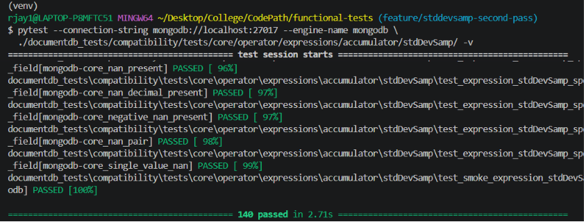

# Contribution 1: [Add compatibility test for `$stdDevSamp`](https://github.com/documentdb/functional-tests/issues/197)

* **Contribution Number:** 1 
* **Student:** Jay Rana  
* **Issue:** [Add compatibility test for `$stdDevSamp`](https://github.com/documentdb/functional-tests/issues/197)
* **Status:** Phase IV

---

## Why I Chose This Issue

I chose this issue because it seems like I'm contributing meaningfully to a project by adding more extensive tests, while also learning things myself. While I have experience with basic unit testing in Python, this issue gives me the opportunity to further learn and improve on it as this is an actual database engine.

This also will be my first issue/contribution, thus I will be learning how to read/follow documentation and effectively contribute to a large project.

---

## Understanding the Issue

### Problem Description (Problem Summary)

The main problem/issue is that currently the expression $stdDevSamp only has a smoke test, it doesn't have actual test cases that test the operator and it's edge cases. Thus, it is really important to add compatibility testing to ensure the function matches what what is expected in MongoDB.


### Expected Behavior

There should be test cases that test for functonality. For us that means there should be test cases that pass with MongoDB as the DB engine. 

### Current Behavior

Currently only the smoke tests run. No other test cases are present to test functonlaity and edge cases of the operator.

### Affected Components

The only affected component/files are in `documentdb_tests/compatibility/tests/core/operator/expressions/accumulator/stdDevSamp/` in which we will create files for the test cases.

---

## Reproduction Process

### Environment Setup

When setting up the main issue I faced was that my WSL was brining up errors after updating Docker after a really long time of it just being idle. However, the fix was really simple and everything worked smoothly after restarting WSL. After this I just had to follow the documentation for installing MongoDB on Docker and installing the the dev-requirements. 

**Working Branch:** https://github.com/Jhr-4/functional-tests/tree/feature/stddevsamp-second-pass

### Steps to Reproduce

1. Run MongoDB in the background on Docker using: `docker run -d -p 27017:27017 --name mongo-test mongo:latest`
2. Run the test cases using: `pytest --connection-string mongodb://localhost:27017 --engine-name mongodb ./documentdb_tests/compatibility/tests/core/operator/expressions/accumulator/stdDevSamp/ -v`
3. There's only one test case that runs which is the smoke test which doesn't do the actual functionality and edge case testing.

### Reproduction Evidence

- **Commit showing reproduction:** https://github.com/Jhr-4/functional-tests/commit/1f76b70f2a15143c18e57e9d0b5de3894f83c2b1
- **Screenshots/logs:** 
- **My findings:** Basically currently there are no functional tests, only some tests.

---

## Solution Approach

### Analysis

There is not error or bug. The issue is that there are no test cases for stdDevSamp currently that test for edge cases of the operator that may throw an error. 

### Proposed Solution

Will create a new file for test cases that test the expression throughly.  

### Implementation Plan

Using UMPIRE framework (adapted):

**Understand:** $stdDevSamp needs test cases that check for edge cases.

**Match:** Currently there are many other issues too regaring tests for oppoarators. However, it seems like many of the testing of the other opporators have not been done yet. I will mostly be following the example for testing for $divide that was provided in the documentation and the actual tests in the [repo](https://github.com/documentdb/functional-tests/blob/main/documentdb_tests/compatibility/tests/core/operator/expressions/arithmetic/divide/test_operator_divide.py). Additonally, there are a few other done like sum in the same parent folder.  

**Plan:** 
1. Create a new file for test cases.
2. Add tests for regular usability, all data types including ones that should be errors or valid, datatype mismatches, test for null returns, check for double/Decimal128. Esecnially I will follow the documentation and the testing guidlines/checklist layed out at: https://github.com/documentdb/functional-tests/blob/main/docs/testing/TEST_COVERAGE.md.
3. Check for sucess and passing of test cases with MongoDB, submit a pull request, itterate if something is missing, etc.

**Implement:** 

**Review:** I will follow the checklist provided here in the [main repo]( https://github.com/documentdb/functional-tests/blob/main/docs/testing/TEST_COVERAGE.md). I will ensure all points are hit and self review.

**Evaluate:** Ensure all my tests pass. Make sure all the points in the contibution doc are followed. There is no other way to evaluate really besides creating the PR and getting feedback from the repo maintainers.

---

## Testing Strategy

### Unit Tests

This is a quick summary of files that were added for unit tests as this issue is about adding unit tests.

- Test cases 1: Added tests for core functionality testing things like different inputs it takes and what it returns, rules such as if N is less than 2
- Test cases 2: Added tests for non numerical values and ensuring they are ignored
- Test cases 3: Added tests for infinity and NaN cases ensuring output is correct.
- Test cases 4: Added tests for input fields / arguments they are accepted correctly.
- Test cases 5: Added tests for boundaries testing they are computed similar to MongoDB.

### Integration Tests

- [ ] Integration scenario 1
- [ ] Integration scenario 2

### Manual Testing

Manual testing includes using python to verify the values written in test cases:
```python
import statistics
statistics.stdev([x, y, ... z]) #where x to z are supposed to be numbers
```

Additionally, using MongoDB's shell. 
```bash
docker exec -it mongo-test mongosh #starting the shell
use test #using the db
db.test.insertOne({ dummy: true }) #adding a document (one time thing)
#actual test:
db.test.aggregate([ 
  {
    $project: {
      result: {
        $stdDevSamp: [vlaues, values, values]
      }
    }
  }
])
```
---

## Implementation Notes

### Week 3 Progress


**What I built:**
- Added core tests, infinity case tests, NaN tests, and non-numerical value tests 

**Challenges faced:**
- Initially I had no clue on what I was doing, what is required, formatting, what exact tests are needed, thus the solution was:
    - Read through documention and learned what exactly is needed for test cases
    - Watched videos on how pytest works 
    - Created a plan to split the test cases into multiple file listing exactly what tests need to be done
- Initally commit messages were done with "" so $ was seen as a variable. Had to reword commit messages, caused all commits to be on same day/time.

**Commits this week:**
- 357b8c8: Add $stdDevSamp core tests 
- 7531837: Add $stdDevSamp infinity tests
- af0badf: Add $stdDevSamp non-numeric tests
- 197a1d3: Reorganize NaN and infinity tests into special value tests

### Week 4 Progress


**What I built:**
- Added different input form tests, null/missing tests, boundary tests, and added additional tests in previous files to make more comprehensive like floating points. Submitted PR.

**Challenges faced:**
- One major problem I faced was that tests were failing. Tests were giving different behvaior compared to what I calculated with Python. The solution was to use MongoDB shell to test things. This allowed for more accurate results and gave insight into rounding that MongoDB does when things are very small and are indistinguishable. 

**Commits this week:**
- c281c3c: Add $stdDevSamp null and missing tests 
- addd1ec: Add test file for $stdDevSamp input form tests
- 2569520: Add additional fractional core tests
- dfbbee9: Add $stdDevSamp boundary tests
- 2ee2223: Add $stdDevSamp non-numeric bool case 
- c35cd08: Fix null tests typo + add 2 more cases

### Week 5 Progress

**What I built:**
- This week there was nothing built. Typos and corrections were made.

**Challenges faced:**
- One challenge was faced with the copilot ai reivew that appears with the pull request. It created a change, but this change was not accepted as it didn't have a valid signature on the commit. It also made the commit message that isn't aligned with the requirement of present tense. The solution was to pull the changes locally and go back to the commit and reword it. Rewroding it automatically added a signature and then force pushed the commit.

**Commits this week:**
- 0883bcc: Fix typo and add explicit is `not None` check
- e5162ca: Fix $stdDevSamp missing handling and test messages


### Code Changes

- **Files modified:** N/A
- **Files Created:** test_expression_stdDevSamp_core.py, test_expression_stdDevSamp_non_numeric.py, test_expression_stdDevSamp_special_values.py, test_expression_stdDevSamp_input_forms.py, test_expression_stdDevSamp_null_missing.py, test_expression_stdDevSamp_boundaries.py
- **Key commits:** [Core + NaN Tests](https://github.com/documentdb/functional-tests/commit/357b8c8eec22b9451648b1953d51eb1ccd09c4f5), [Infinity Tests](https://github.com/documentdb/functional-tests/commit/7531837646507c776a39a62a3d17a8648349b055), [Non-Numerical Tests](https://github.com/documentdb/functional-tests/commit/af0badfdfec0d80e31948dfd6673b92b3e9260e2), [NULL + Missing Tests](https://github.com/documentdb/functional-tests/pull/661/commits/c281c3cedaad4accb81334c37dca53b999e74977), [Input Forms](https://github.com/documentdb/functional-tests/pull/661/commits/addd1ec57d86de927ae5699ac091d4cf36e0b99b), [Boundary Tests](https://github.com/documentdb/functional-tests/pull/661/commits/dfbbee9381861c3fa5971f18cca9de6f4ed58b72)
- **Approach decisions:** [Why you chose certain approaches]



---

## Pull Request

**PR Link:** https://github.com/documentdb/functional-tests/pull/661

**PR Description:** Add compatibility test coverage for $stdDevSamp expression operator covering core, boundary, type validation, null/missing cases.

**Maintainer Feedback:**
- 6/30/26: Copilot review stated the MISSING tests that I have don't make sense as MISSING isn't a value, it's an concept of being missing. It can't be added into an array. There were also typos to fix in some messages that were left.
- 6/30/26: I removed the tests with MISSING used as a vlue. Also updated the typos in the messages.

**Status:** Awaiting Review from Maintainers.

---

## Learnings & Reflections

### Technical Skills Gained

The main thing I learned was reading documentation and working with pytest. I learned how to read contibution guidelines, see exactly whats expected, and then actually work on it. On top of this, I gained knowledge on how to actually use Pytest writing parameterized tests.

### Challenges Overcome

The setup was the hardest part. Getting to know how to actually work with Docker's MongoDB container, what is expected, what tests are needed. After figuring out the 'how' things work, it was pretty easy to actually get things done. I also figured out other people were also writing tests and I used it as a base to start.

### What I'd Do Differently Next Time

I would like to spend more time on reading the documentation and more time understanding what exactly is needed. I found some parts to be alittle undetailed and I should of asked questions in the actual issue page.

---

## Resources Used
- [YouTube - pytest Tutorial](https://www.youtube.com/watch?v=cHYq1MRoyI0)
- [Official Documentation for stdDevSamp](https://www.mongodb.com/docs/manual/reference/operator/aggregation/stdDevSamp/)


## Note to grader:
* Please reevlaute Phase 1:
  * Problem summary was present initially, but was given 0 points. Now it's clearly labled.
  * Bonus was also done talking about $divide example, now it's actually linked.
  * Acceptance checklist was also linked going to the contibution repo. 
* Please reevaluvate Phase 2: 
  * "Plan identifies a root cause (not just a symptom) and names specific files to modify" there was no broken logic. The whole idea of the issue was to add test cases. Please don't peanlize for something the issue doesn't cover.
  * Celebration on slack added.
* Please reevaluvate Phase 3: 
  * Challenges & problems were always mentioned.
  * Bonus, edge case of N<2 was never mentioned, it was added by myself.
  * Test cases passing proof added. 'after.png'
  * Celebration on slack added.
* Please reevaluvate Phase 4: 
  * Now PR uses the project's PR template
  * 'Why' before 'what' - description is provided on why changes are needed.
  * There's no acceptance criteria in the given format given by the rep's CONTRIBUTION.md. Besides all tests passing and all tests being included.
  * Added Maintainer Feedback of copilot.
  * Celebration on slack added.

Check-In on courses.codepath.org for each week has been submitted before hard deadline. Not sure why grading sheet gives 0 points for each.

**Note:** Please fix instructions if 'slack celebration' is going to be graded. Make it required. No point in saying "Recomended" on courses website.
> "#dts-su26-ai301-celebration in Slack (recommended)"