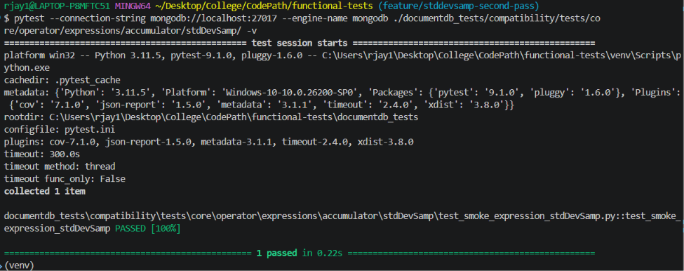

# Contribution 1: [Add compatibility test for `$stdDevSamp`](https://github.com/documentdb/functional-tests/issues/197)

* **Contribution Number:** 1 
* **Student:** Jay Rana  
* **Issue:** [Add compatibility test for `$stdDevSamp`](https://github.com/documentdb/functional-tests/issues/197)
* **Status:** Phase II

---

## Why I Chose This Issue

I chose this issue because it seems like I'm contributing meaningfully to a project by adding more extensive tests, while also learning things myself. While I have experience with basic unit testing in Python, this issue gives me the opportunity to further learn and improve on it as this is an actual database engine.

This also will be my first issue/contribution, thus I will be learning how to read/follow documentation and effectively contribute to a large project.

---

## Understanding the Issue

### Problem Description

There is no bug or error. The main problem/issue is that currently the expression $stdDevSamp only has a smoke test, it doesn't have actual test cases that test the operator and it's edge cases. 


### Expected Behavior

There should be test cases that test for functonality. For us that means there should be test cases that pass with MongoDB as the DB engine. 

### Current Behavior

Currently only the smoke tests run. No other test cases are present to test functonlaity and edge cases of the operator.

### Affected Components

The only affected component/files are in `documentdb_tests/compatibility/tests/core/operator/expressions/accumulator/stdDevSamp/` in which we will create files for the test cases.

---

## Reproduction Process

### Environment Setup

When setting up the main issue I faced was that my WSL was brining up errors after updating Docker after a really long time of it just being idle. However, the fix was really simple and everything worked smoothly after restarting WSL. After this I just had to follow the documentation for installing MongoDB on Docker and installing the the dev-requirements. 

**Working Branch:** https://github.com/Jhr-4/functional-tests/tree/feature/stddevsamp-second-pass

### Steps to Reproduce

1. Run MongoDB in the background on Docker using: `docker run -d -p 27017:27017 --name mongo-test mongo:latest`
2. Run the test cases using: `pytest --connection-string mongodb://localhost:27017 --engine-name mongodb ./documentdb_tests/compatibility/tests/core/operator/expressions/accumulator/stdDevSamp/ -v`
3. There's only one test case that runs which is the smoke test which doesn't do the actual functionality and edge case testing.

### Reproduction Evidence

- **Commit showing reproduction:** https://github.com/Jhr-4/functional-tests/commit/1f76b70f2a15143c18e57e9d0b5de3894f83c2b1
- **Screenshots/logs:** 
- **My findings:** Basically currently there are no functional tests, only some tests.

---

## Solution Approach

### Analysis

There is not error or bug. The issue is that there are no test cases for stdDevPop currently that test for edge cases of the operator that may throw an error. 

### Proposed Solution

Will create a new file for test cases that test the expression throughly.  

### Implementation Plan

Using UMPIRE framework (adapted):

**Understand:** $stdDevSamp needs test cases that check for edge cases.

**Match:** Currently there are many other issues too regaring tests for oppoarators. However, it seems like none of the testing of the other opporators has been done yet. I will mostly be following the example for testing for $divide that was provided in the documentation.

**Plan:** 
1. Create a new file for test cases.
2. Add tests for regular usability, all data types including ones that should be errors or valid, datatype mismatches, test for null returns, check for double/Decimal128. Esecnially I will follow the documentation and the testing guidlines/checklist layed out at: https://github.com/documentdb/functional-tests/blob/main/docs/testing/TEST_COVERAGE.md.
3. Check for sucess and passing of test cases with MongoDB, submit a pull request, itterate if something is missing, etc.

**Implement:** 

**Review:** I will follow the checklist provided here in the [main repo]( https://github.com/documentdb/functional-tests/blob/main/docs/testing/TEST_COVERAGE.md). I will ensure all points are hit and self review.

**Evaluate:** Ensure all my tests pass. Make sure all the points in the contibution doc are followed. There is no other way to evaluate really besides creating the PR and getting feedback from the repo maintainers.

---

## Testing Strategy

### Unit Tests

This is a quick summary of files that were added for unit tests as this issue is about adding unit tests.

- Test cases 1: Added tests for core functionality testing things like different inputs it takes and what it returns, rules such as if N is less than 2
- Test cases 2: Added tests for non numerical values and ensuring they are ignored
- Test cases 3: Added tests for infinity and NaN cases ensuring output is correct.

### Integration Tests

- [ ] Integration scenario 1
- [ ] Integration scenario 2

### Manual Testing

Manual testing includes using python to verify the values written in test cases:
```python
import statistics
statistics.stdev([x, y, ... z]) #where x to z are supposed to be numbers
```

---

## Implementation Notes

### Week 3 Progress


**What I built:**
- Added core tests, infinity case tests, NaN tests, and non-numerical value tests 
[What you built this week, challenges faced, decisions made]

**Challenges faced:**
- Initially I had no clue on what I was doing, what is required, formatting, what exact tests are needed, thus:
    - Read through documention and learned what exactly is needed for test cases
    - Watched videos on how pytest works 
    - Created a plan to split the test cases into multiple file listing exactly what tests need to be done
- Initally commit messages were done with "" so $ was seen as a variable. Had to reword commit messages, caused all commits to be on same day/time.

**Commits this week:**
- 357b8c8: Add $stdDevSamp core tests 
- 7531837: Add $stdDevSamp infinity tests
- af0badf: Add $stdDevSamp non-numeric tests
- 197a1d3: Reorganize NaN and infinity tests into special value tests

### Week [Y] Progress

[Continue documenting as you work]

### Code Changes

- **Files modified:** N/A
- **Files Created:** test_expression_stdDevSamp_core.py, test_expression_stdDevSamp_non_numeric.py, test_expression_stdDevSamp_special_values.py
- **Key commits:** [Core + NaN Tests](https://github.com/documentdb/functional-tests/commit/357b8c8eec22b9451648b1953d51eb1ccd09c4f5), [Infinity Tests](https://github.com/documentdb/functional-tests/commit/7531837646507c776a39a62a3d17a8648349b055), [Non-Numerical Tests](https://github.com/documentdb/functional-tests/commit/af0badfdfec0d80e31948dfd6673b92b3e9260e2)
- **Approach decisions:** [Why you chose certain approaches]

---

## Pull Request

**PR Link:** [GitHub PR URL when submitted]

**PR Description:** [Draft or final PR description - much of the content above can be adapted]

**Maintainer Feedback:**
- [Date]: [Summary of feedback received]
- [Date]: [How you addressed it]

**Status:** [Awaiting review / Iterating / Approved / Merged]

---

## Learnings & Reflections

### Technical Skills Gained

[What you learned technically]

### Challenges Overcome

[What was hard and how you solved it]

### What I'd Do Differently Next Time

[Reflection on your process]

---

## Resources Used
- [YouTube - pytest Tutorial](https://www.youtube.com/watch?v=cHYq1MRoyI0)
- [Link to helpful documentation]
- [Tutorial or Stack Overflow post that helped]
- [GitHub issues or discussions that helped]
